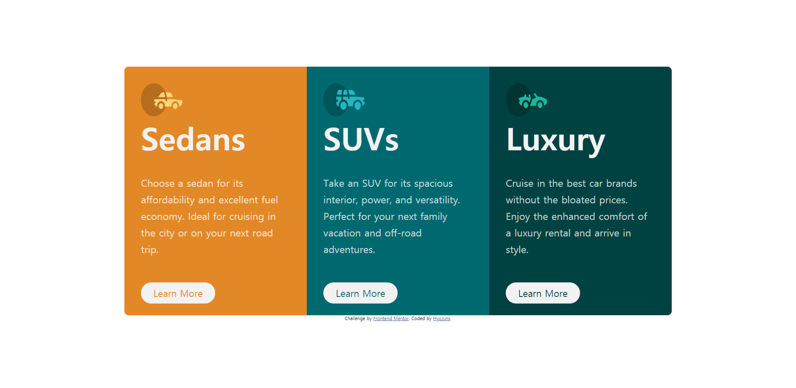
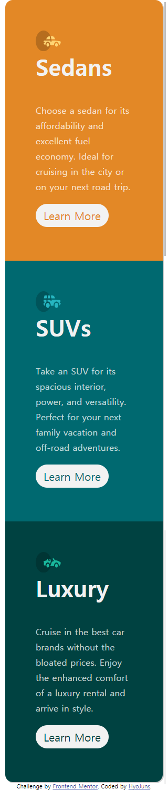

# Frontend Mentor - 3-column preview card component


## Overview

### The challenge
Users should be able to:

- View the optimal layout depending on their device's screen size
- See hover states for interactive elements

### Screenshot
;
;

### Links

- Solution URL: [Add solution URL here](https://github.com/HyoJuns/3-column-preview-card-component-main)
- Live Site URL: [Add live site URL here](#)

## My process

### Built with
- Semantic HTML5 markup
- CSS custom properties
- Flexbox
- Sass

### What I learned

```scss
$breakpoints : (
    'mobile-start' : 320px,
    'mobile-end' : 425px,
    'desktop-start' : 426px
);


@mixin Mobile
{
    $start : map-get($breakpoints, 'mobile-start');
    $end : map-get($breakpoints, 'mobile-end');
    @media (min-width : $start) and (max-width : $end) {
        @content;
    }
}

@mixin Desktop
{
    $start : map-get($breakpoints, 'desktop-start');
    @media (min-width : $start){
        @content;
    }
}
```

### Continued development
RWD (Responsive Web Design) Study